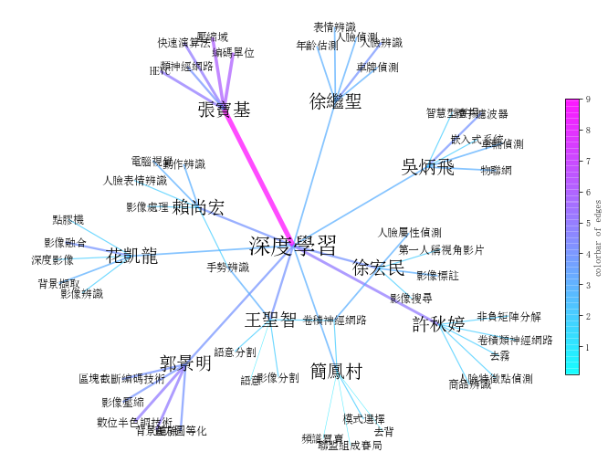

# 學研專家分析網絡 (SNA)
### 一、簡介

**目標：**利用`科技部計畫清單`與`碩博士論文資料`建立**異質資訊網路**，來表現學者與研究技術間的整體關係，更進而分析出熱門技術與學者社群

**說明：**

1. 科技部計畫清單：由工程中心提供的excel檔
   - 科技部計畫清單存入資料庫程式：
2. 碩博士論文資料：利用前項計畫主持人姓名，在碩博士論文網爬取該姓名擔任指導老師的論文資料
   - 碩博士論文爬蟲程式：[/project_code/thesesCrawler.py](https://github.com/tsaijou/sna_network/blob/main/project_code/thesesCrawler.py)
3. 異質資訊網路：每一篇研究文獻中 (論文/計畫)，學者姓名、文獻關鍵詞等不同類型資料 (節點node) 之間建立的關係 (連線link) 網絡

 

**成果：**將SNA分析結果視覺化
1. 分為7大主題，可依照設定輸入欲查詢的學者姓名、年分...等條件
2. 靜態視覺化圖片利用python的**networkx套件**繪製，網頁視覺化利用**amCharts套件**繪製

### 二、資料處理流程流程
1. **原始資料：**(PI=計畫主持人)
    

        
    

    
   **步驟1.** 科技部計畫清單資料存於4個資料表：`project_rawdata`經過中文關鍵詞清理與**身份辨識**(個資&計畫標題)，將計畫與PI資料分存入`project_info`、`project_researcher_info`；新PI姓名存入`thesis_crawler_log`
   - 身份辨識方法(同名同姓PI)：利用計畫清單中的個資(申請單位、e-mail、電話)辨識，再與科技部人才查詢網頁中PI執行過的計畫標題比對後確認身份
      - 科技部人才查詢網頁爬蟲程式：
   
   **步驟2.** 根據thesis_crawler_log中的PI姓名作為指導教授姓名進行碩博士論文資料爬取，存入`thesis_rawdata`
   
   **步驟3.** thesis_rawdata經過中文關鍵詞清理與年份判定後存入`thesis_info`，指導老師資料存入`thesis_advisor_info`，新指導老師姓名存入thesis_crawler_log

   **步驟4.** 以大專校院教師資料為基準，與project_researcher_info資料進行比對，若有相符，則納入`scholar_info`

    
2. **繪圖資料：**

### 三、SNA視覺化範例模板
#### Graph1 歷年熱門關鍵詞網絡
1. 呈現碩博論文與科技部計畫中，熱門關鍵詞之間的關係強弱
2. 篩選條件：年份 (ex.2019年)、關鍵詞數量 (ex.50個)
- `網頁視覺化`
   - 程式檔案：[graph1.html](https://github.com/tsaijou/sna_network/blob/main/visualization/graph1/graph1.html)
   - 網頁範例：[graph1](https://tsaijou.github.io/sna_network/visualization/graph1/graph1)
- `靜態圖片`
   - 程式檔案：[network1.py](https://github.com/tsaijou/sna_network/blob/main/visualization/graph1/network1.py)
   
      

圖片範例：2019年前50名關鍵詞 (點擊展開)

        

            
        

      

#### Graph2 重點技術學者查詢
1. 呈現文獻中使用研究技術 (關鍵詞) 篇數最多的前10名學者，以及每位學者在文獻中使用次數最多的前5個關鍵詞
2. 篩選條件：關鍵詞 (ex.深度學習)、年份區間 (ex.2011~2016年)
- `網頁視覺化`
   - 程式檔案：[graph2.html](https://github.com/tsaijou/sna_network/blob/main/visualization//graph2/graph2.html)
   - 網頁範例：[graph2](https://tsaijou.github.io/sna_network/visualization//graph2/graph2)
- `靜態圖片`
   - 程式檔案：[network2.py](https://github.com/tsaijou/sna_network/blob/main/visualization//graph2/network2.py)
   
      

圖片範例：2012年~2016年論文或計畫中使用關鍵詞「深度學習」最多次的學者與其研究領域 (點擊展開)

        

            
        

      

     
#### Graph3 研究技術 (關鍵詞) 網絡
1. 呈現碩博論文與科技部計畫中，與研究技術 (關鍵詞) 較相關的30個關鍵詞及之間的關係
2. 篩選條件：關鍵詞 (ex.再生能源)
- `網頁視覺化`
   - 程式檔案：[graph3.html](https://github.com/tsaijou/sna_network/blob/main/visualization//graph3/graph3.html)
   - 網頁範例：[graph3](https://tsaijou.github.io/sna_network/visualization//graph3/graph3)
- `靜態圖片`
   - 程式檔案：[network3.py](https://github.com/tsaijou/sna_network/blob/main/visualization//graph3/network3.py)
   
      

圖片範例：「再生能源」領域研究技術網絡 (點擊展開)

        

            
        

      

      
#### Graph4 工程學門研究技術網絡
1. 科技部計畫中，所屬學門計畫的熱門關鍵詞 (使用次數前25名) 及之間的關係
2. 篩選條件：2個工程學門 (ex.微電子工程、資訊工程(資訊))
- `網頁視覺化`
   - 程式檔案：[graph4.html](https://github.com/tsaijou/sna_network/blob/main/visualization//graph4/graph4.html)
   - 網頁範例：[graph4](https://tsaijou.github.io/sna_network/visualization//graph4/graph4)
- `靜態圖片`
   - 程式檔案：[network4.py](https://github.com/tsaijou/sna_network/blob/main/visualization//graph4/network4.py)
   
      

圖片範例：「資訊工程(資訊) & 微電子工程」學門重點關鍵詞 (點擊展開)

        

            
        

      

      
#### Graph5 工程學門之間的合作網絡
1. 呈現19個科技部工程學門透過計畫主持人之間合作產生的強弱關係
2. 篩選條件：最低合作次數 (ex.至少合作10次)
- `網頁視覺化`
   - 程式檔案：[graph5.html](https://github.com/tsaijou/sna_network/blob/main/visualization//graph5/graph5.html)
   - 網頁範例：[graph5](https://tsaijou.github.io/sna_network/visualization//graph5/graph5)
- `靜態圖片`
   - 程式檔案：[network5.py](https://github.com/tsaijou/sna_network/blob/main/visualization//graph5/network5.py)
   
      

圖片範例：不同計畫主持人間跨學門合作關係 (點擊展開)

        

            
        

      

      
#### Graph6 學者關係網絡
1. 呈現學者間的合作關係強弱
2. 篩選條件：姓名 (ex.鄧維光)、年份區間 (ex.2010~2018年)、學者關係 (ex.指導老師&口試委員)
- `網頁視覺化`
   - 程式檔案：[graph6.html](https://github.com/tsaijou/sna_network/blob/main/visualization//graph6/graph6.html)
   - 網頁範例：[graph6](https://tsaijou.github.io/sna_network/visualization//graph6/graph6)
- `靜態圖片`
   - 程式檔案：[network6.py](https://github.com/tsaijou/sna_network/blob/main/visualization//graph6/network6.py)
   
      

圖片範例：2010年~2018年間與「鄧維光」合作的學者 (點擊展開)

        

            
        

      

      
#### Graph7 學者的關鍵詞文字雲
1. 呈現學者在碩博論文與科技部計畫中，經常使用的關鍵詞
2. 篩選條件：姓名 (ex.陳彥宏)、年份區間 (ex.2010~2018年)
- `網頁視覺化`
   - 程式檔案：[graph7.html](https://github.com/tsaijou/sna_network/blob/main/visualization//graph7/graph7.html)
   - 網頁範例：[graph7](https://tsaijou.github.io/sna_network/visualization//graph7/graph7)
- `靜態圖片`
   - 程式檔案：[network7.py](https://github.com/tsaijou/sna_network/blob/main/visualization//graph7/network7.py)
   
      

圖片範例：「陳彥宏」學者於2011~2020年的關鍵詞文字雲 (點擊展開)

        

            
        

      

 
